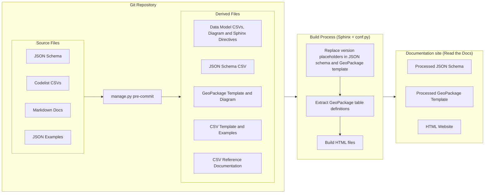
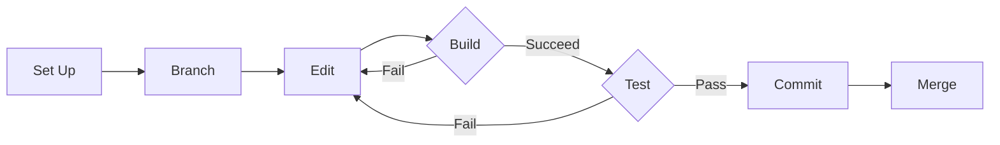

# Introduction

This page provides an introduction for new maintainers of the Open Fibre Data Standard (OFDS).

## The tech stack

The standard is built using a ["Docs as Code"](https://www.writethedocs.org/guide/docs-as-code/) approach, ensuring that the schema, codelists and documentation remain synchronized.

* **Schema:** [JSON Schema 2020-12](https://json-schema.org/understanding-json-schema/reference#json-schema-reference) with the [Open Data Services JSON Schema Extension](https://docs.opendataservices.coop/projects/json-schema-extension/latest/)
* **Codelists:** CSV files structured according to the [Open Data Services Codelist Schema](https://docs.opendataservices.coop/projects/codelist-schema/latest/)
* **Documentation:** [Sphinx](https://www.sphinx-doc.org/) using [MyST-Parser](https://myst-parser.readthedocs.io/) for Markdown support.  
* **Language:** Python 3.12+ (for build scripts, testing, and CLI utilities).  
* **Hosting:** [Read the Docs](https://readthedocs.org/) for automated versioned deployments.  
* **Quality Assurance:** [pytest](https://docs.pytest.org/en/stable/) for logic/schema validation, [mdformat](https://mdformat.readthedocs.io/en/stable/) for Markdown formatting, [GitHub Actions](https://docs.github.com/en/actions) for continuous integration.

## How the documentation is built

The following diagram illustrates how the source files in the repository are transformed into the final published standard.

## Contribution workflow

The following diagram illustrates the workflow for making changes to the schema, codelists and documentation.

The key steps in the workflow are:

1. **Set up your development environment:** Install the tools you need to edit, test and build the standard. The recommended approach is to [use GitHub Codespaces](setup.md#use-github-codespaces), a pre-configured and hosted development environment.
2. **Create a branch:** Create a branch from the current staging branch, to develop features, fix bugs, or safely experiment with new ideas in a contained area of the repository.
3. **Edit files:** Edit the schema, codelists and/or Markdown files in the repository's [directory structure](repository.md#structure).
4. **Build the documentation**:** Check that the build succeeds, [correct any errors](build.md#resolve-build-errors), and preview your changes locally.
5. **Test the schema and codelists:** [Run tests](build.md#run-tests) to identify common issues and [resolve any failures](build.md#resolve-test-failures).
6. **Commit your changes:** Once the docs build succeeds, the tests pass, and you are happy with your changes, commit them to your branch.
7. **Merge your changes:** Create a pull request to merge your changes into the current staging branch for inclusion in a future release.